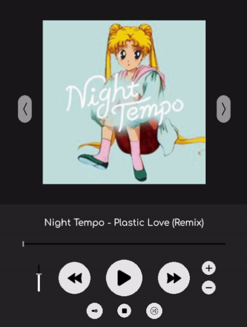
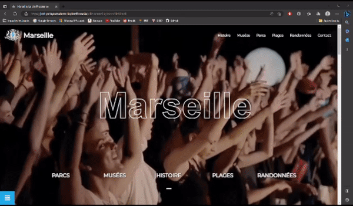

# 
**Hi 👋, I'm PELAYO Joël**

Currently studying at La Plateforme_ and passionate about video games, i'm an aspiring game developer. I began to learn programming and computer science in general by myself for about 2 years now. I first started by learning C#, Unity and blender and then took the CS50 course from Harvard University in 2021 to learn even more about computer science. This GitHub profile was created for my Bachelor IT at La Plateforme_ so you'll mainly see project related to it, I also had a GitHub profile that I used for the CS50 course under the username "<a href=https://github.com/Burger-Code>Burger-Code</a>" (all repos on it are private).

- 🔭 I’m currently working on this repo: [myDiscord](https://github.com/livio-gonzalez-luna/myDiscord).

- 🌱 I’m also learning on the side **C++ for Game development**.

- 📫 You can reach me here **joel.pelayo@laplateforme.io** or on my [LinkedIn]("https://www.linkedin.com/in/jo%C3%ABl-pelayo/?locale=en_US").

- 📄 Get to know more about my experiences with my [resume](https://drive.google.com/file/d/15b5yMSHDEedpRhbxWdkU2Q1qJe0mI7JG/view?usp=share_link).

  

## 
**Notable projects**

As I said in my introduction, this profile will mostly hold projects that are related to my school. Here are some of them that I deem worth to showcase:
<table style="margin:10%" align="center">
    <tr>
        <td>
            

                
                
Tetris 69

            

        </td>
        <td>
            

                
                
Pokemon DELTA Emerald (on hold)

            

        </td>
        <td>
            

                
                
Player Music

            

        </td>
    </tr>
    <tr align="center">
        <td>
            

        </td>
        <td>
            

                
                
Ville-Marseille

            

        </td>
        <td>
            

        </td>
    </tr>
</table>

  

## 
**Profile stats overview**

<h3 align="left">Connect with me:</h3>

<h3 align="left">Languages and Tools:</h3>

              

&nbsp;

